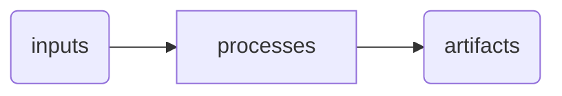
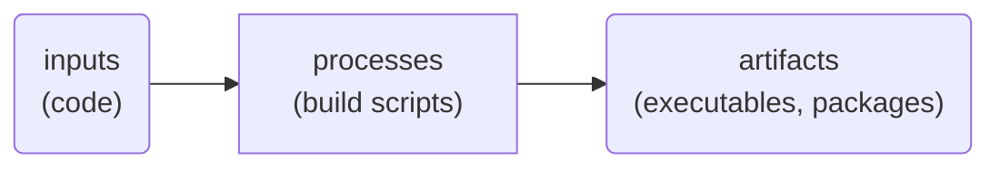
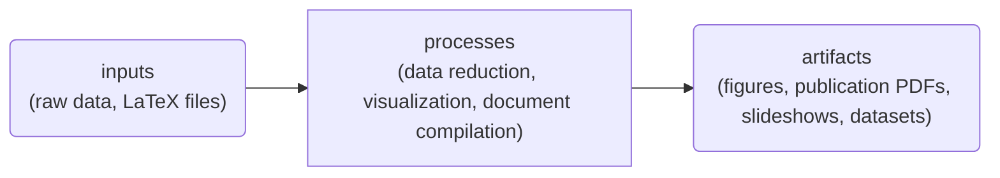
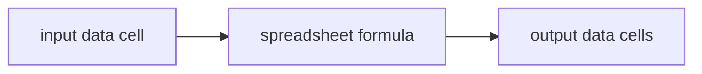

In the 21st century,
the principles of
[lean startup](https://en.wikipedia.org/wiki/Lean_startup),
[agile software development](https://en.wikipedia.org/wiki/Agile_software_development),
and [DevOps](https://en.wikipedia.org/wiki/DevOps)
have significantly reduced waste, improved quality,
enhanced innovation,
and increased the speed of development of software products and related
technology by breaking down silos,
improving collaboration,
and moving towards working in smaller batches with faster feedback loops
to succeed in uncertain environments.
At the same time, the
[pace of scientific innovation appears to be slowing](https://doi.org/10.1257/aer.20180338),
with many findings failing to replicate
(validated in an end-to-end sense, re-acquiring and reanalyzing raw data)
or even to be reproduced
(verified by rerunning the same computational processes
on the same input data).
Though the products of science only sometimes include software,
I believe there is more science can learn from the software field
in these areas.

Here I will focus on one set of practices in particular:
those of _Continuous Integration_ and _Continuous Delivery_
([CI/CD](https://en.wikipedia.org/wiki/CI/CD)).
There has been some discussion about adapting these
and calling it
[_Continuous Analysis_](https://arxiv.org/abs/2411.02283),
though I think the concept extends beyond analysis and into
generating other artifacts like figures and publications,
which oftentimes serve as the primary interfaces to the knowledge
science creates.
Therefore, here we will use the term
_Continuous Reproducibility_ (CR).

## Defining CI/CD

What is CI/CD and why has it become the norm for software teams?
CI means that valuable changes are integrated or incorporated into the
single source of truth, i.e., the main branch, as soon as they
are produced,
and CD means that the external world has access to these changes as
quickly as possible.
Silos are broken down as a single team then owns both development
and operations (hence "DevOps").
That is, the development team handles testing/QA and deployment,
whereas in the past this might have been handled by multiple teams with
heavy documentation handoffs between them in lieu of true collaboration.
Work batch sizes shrink as developers start merging in frequent small
changes to the codebase instead of larger, less frequent
(sometimes taking months or years) updates.

## The end of the waterfall

This more agile way of working evolved in response to the failures of the
[waterfall project management](https://en.wikipedia.org/wiki/Waterfall_model)
model,
which splits a project up into multiple phases or "stage gates,"
often owned by different people and moved through by handing off
large amounts of documentation.
For example, design, implementation, testing, and deployment all might
be siloed in different teams.
The source of inefficiency in this way of working is the high cost
of returning to previous stages after moving forward.
For example,
if a problem shows up in testing,
we may need to go back and redesign and reimplement parts of the software.
Working in smaller chunks and testing each one
allows us to discover issues earlier where
they are cheaper to fix.

We can see some waterfall aspects in research as well.
Data collection might be treated as a distinct phase
from data analysis,
which might be siloed from writing.
This would be fine if we never needed to return to earlier stages,
but anyone who has ever been part of the review process for a journal
article
should know that it's very likely you'll to need to revisit data analysis
and visualization to fulfill requested changes to the article.

## The role of automation

CI/CD is impractical without automation,
and thus automation was and is a key enabler.
As part of CI,
a suite of automated tests will run,
often on an independent computer,
to ensure changes will not break the codebase in ways that are hard to predict.
If the tests pass, the changes are merged.
Then, an automated CD pipeline will run
(also usually on an independent computer) to build
any necessary artifacts and send them where they need to go
(a web server, package download service, etc.).
Whatever is released out into the world is then totally consistent
with the single source of truth that is the main branch.
If these processes were not automated,
they would be more painful to carry out and would naturally be done less
frequently,
which reduces speed and quality.
The sense of confidence and reduced anxiety that comes from having
things automated makes it much easier to explore different ideas without
the fear of destroying previous progress.

## General principles

So what would it mean for a research project to be "Continuously Reproducible?"
We can extract a few core principles from the CI/CD processes defined above:

1. There is a single source of truth for all input materials and process
   definitions.
   Practically this means a shared version control repository or repo.
   Different team members can easily sync with this main repo.
2. These processes can be run on different computers, i.e., they are not
   dependent on some "hidden state" of one developer's machine.
3. Whatever is delivered to the outside world is always
   consistent with the input
   materials and process definitions.
   Through the use of version control, we can always go back in time to the
   input materials and process definitions that produced any given artifact
   and produce it again.
4. Getting the project into a consistent state after making a change requires
   very little effort from the team members.
   Practically speaking, this would mean executing a single command
   rather than a series of manual steps.
   It may require a good deal of work from a computer, but not a human.

## Signs that you could benefit from these ideas

1. You dread the prospect of getting a new computer,
   because getting everything setup to work would take days.
2. You dread the prospect of changing a data processing script,
   because you aren't sure what else would need to be updated to keep things
   consistent.
   For example, there could be figures that need to be updated,
   or aggregate numbers listed in a paper that were entered manually.
3. You dread the prospect of updating figures because you'll need to
   manually copy files into a different project or tool to update the relevant
   publication.
4. You're the only person on your team who knows how to run the scripts in
   your project, i.e., you're working in a silo.
5. You feel like you're working on the edge of a cliff,
   like one small change would send an entire house of cards toppling down.

## How to get there

Let's explore these more deeply and see how they can be followed or not.

This section is going to be slightly biased towards
[Calkit](https://github.com/calkit/calkit),
a project framework and toolset I've been working on to help
enable CR,
but it is by no means the only way to follow the principles,
and I will try to provide other options.

But what if you're already halfway through the project?
That's okay.
You can start working reproducibly from now.
At least you can put everything you have right now into version control,
then start adding to the pipeline for everything that needs to be
created after.

### Create a single version-controlled repo for the entire project

To say that a research project has a "single source of truth"
we probably need to define what constitutes a project.
How do we draw the boundaries?

Always better to err on the side of too big and break it up later
than start too small.

Practically speaking,
all work done throughout a master's or PhD program can go in a single
project so long as the topic hasn't changed.

That means we don't want to create a separate smaller project for a
conference presentation,
another separate project for a journal article,
and yet another for our thesis.
Start with one project, because all of these are inherently coupled to
each other, i.e.,
they will share input data and process definitions.

We've already established that we want to move away from
very small projects, but what's the limit?
Should we draw the line at a single paper?
What if we have a follow-on investigation on the same topic?

If you want to be able to test and build artifacts,
you'll want to keep everything in one place.
This is the same for a research project.
Storing a dataset somewhere far away from the

Keep your project general at first.
That is, dump all files into a single place.
Don't split into a bunch of different projects,
e.g., one for a lit review,
one for your proposal, one for the experiment,
one for the analysis code,
one for the journal article,
and one for the thesis.

It's almost always better to go from large to small than the other way
around.
In software development,
this principle is known as premature abstraction,
and it is well known that the wrong abstraction is much more expensive
than no abstraction at all.

A similar concept is that of a "monorepo,"
or a single repository containing multiple sub-projects.
This is much better than excessive fragmentation.
In fact,
Google uses a single monorepo for most of their code.

You should keep literally everything in the project that matters,
which includes raw data.
Calkit leverages DVC for versioning larger data files and

#### Avoid splintering into many small projects from the start

This is analogous to the "distributed monolith" software architecture,
where tightly coupled components are spread across multiple codebases
and/or infrastructure groups.
In research, this could take the form of one repo for the data collection,
one repo for the data processing software,
one repo for the paper.
These are all inherently coupled in service of producing the paper.
Just keep them together in the same repo.
If by change some sub-component, e.g., the software,
becomes useful on its own,
deal with that afterwards, not up front.

### Minimize and automate dependencies

Instead of a list in the README that says "install A, install B, install C..."
use virtual environments and/or containers.

If you define all of your environments with Calkit,
you will not even need to instruct your users on how to create them.

If you absolutely require things to be installed system-wide,
try to keep them to a minimum and try to automate their installation with
a script or something similar.

### Allow reproducing everything with a single command

This follows a similar principle as above:
Avoid giving lists of steps to follow in the README,
which is sort of like a manual pipeline in prose.

If you're using Calkit,
you can put all steps into a DVC pipeline.

Alternatives include Make, Snakemake, or a shell script.
If the project is super lightweight, e.g.,
a pure writing project with no figure generation,
the "pipeline" could be to save a Word document as a PDF.

showyourwork...

Coincidentally,
the ["repro pack" attached to [1]](https://doi.org/10.3886/E111743V2)
appears to have 10 separate pipelines,
with no instructions on how to run them,
if there is any inter-dependence, etc.

It also doesn't contain the paper manuscript compilation.

If a pipeline is written in English and can't be run all with a single
command,
it's not really a pipeline.
There will almost certainly be information missing.
This includes setting up dependencies as well.

Use a system that is as simple as possible.

Don't fall prey to waterfall processes, e.g.,
assuming that data analysis is done,
and that writing a paper is a totally separate stage gate.
Changing data analysis when moving into a different "silo"
will be more expensive.

Don't fragment into multiple small pipelines.

Avoid hopping back and forth between different tools.
For example, instead of opening MATLAB to run data analysis scripts
and uploading figures manually to Overleaf,
use a more general tool like
VS Code that can edit/run both MATLAB and LaTeX files.

### Use caching, but try not to roll your own

Caching is one of the hardest tasks in software engineering.
Offload that responsibility to a framework.

### Use a CI/CD service

For example,
run your pipeline on GitHub Actions, which is free for public projects.
See [this example](https://github.com/calkit/example-basic/blob/main/.github/workflows/run.yml)
for a Calkit project that runs automatically on every push to GitHub.

## CR and open science

One important missing principle is a holistic view.
The project should be the important unit.
Yes, there are modules and subcomponents,
but these all exist in a larger picture.
Practically speaking,
this means all files belong together in a single collection.
This includes proposals, notes, drawings, data, code, figures, slideshows,
articles, etc.

Working in a continuously reproducible way will provide the confidence
to share all materials associated with a research project openly.

One tactic practiced by the open science community is to publish
a ["reproducibility pack" or "repro pack"](https://lorenabarba.com/blog/how-repro-packs-can-save-your-future-self/)
along with each scientific article.
However, in my experience,
these are often curated after the project is mostly finished, i.e.,
as a distinct "phase" in the project,
and therefore were not actually used throughout the process.
They often only include a subset of the files,
e.g., only the datasets, or only the code,
but not the files used to generate the figures or manuscript.
Further, they are usually missing some information that only the researcher
knows since they are working with the files every day on a computer
whose state (operating system, software installed, etc.)
may have evolved over years.
[I am guilty of this too](https://petebachant.me/failed-to-repro/).

So instead of having a "create repro pack" phase,
the entire project repo should be a repro pack from the very start.
This is enabled by CR.

## The role of interactive or non-automated workflows

I was looking back at my research materials from my master's thesis the other
day, and I noticed how this holistic view was not taken.
Every small task got its own folder,
and these were interspersed with folders related to coursework
and other administrative documents.
I recommend that all files related to research on a given topic belong
in one folder.
Yes, there can be subfolders, but don't try to create silos between them
up front.

These workflows can be distinguished by how long "throwaway" work
lives without being incorporated into the single source of truth.

A non-CR workflow would be...

The "throwaway" work should only exist for minutes instead of days.
Again, to draw the analogy to software development,
some interactive development (e.g., using a debugger)
can be done for minutes to hours,
a valuable change is discovered,
and a "pull request" is submitted.
Working on a potential change for many days, weeks, or even months
is a bad practice.

Let's first start with some principles:

1. The research project itself should be thought of as a single unit.
   It is not helpful to silo the data analysis phase from the writing phase.
   These are inherently coupled, and treating them as if they are not will
   be less efficient.
2. A single command should kick off everything.
   No lists of setup steps.
   No "go into this folder and run ..., then go into this folder and run..."
   You will probably not describe these instructions accurately enough,
   so automate them into a single pipeline.

Coincidentally,
today I was setting up a CI pipeline for
[Calkit](https://github.com/calkit/calkit).
Even though the tests all run fine on my machine,
it took me
[15 iterations](https://github.com/calkit/calkit/pull/273)
to get them running up on the GitHub Actions CI/CD service.
Along the way, I discovered that the contributor's guide
was missing
[one system-level dependency](https://github.com/calkit/calkit/commit/ae3b3bf8d969bdf1714470967da4d650bbdd2bd3).

This is very important for collaboration because there were some details
about my own laptop that I had forgotten about (hidden state),
which allow the tests to run fine on my machine,
but would fail on others.
If you're working completely alone,
maybe this doesn't matter,
but you probably want it to be easy for someone to build upon your
work so it has the maximum impact, right?
If someone can't get your project to run,
how are they supposed to build upon it?
Further,
what if you have a team working on the project?
You're going to want it to be easy for anyone on the team to contribute.
In this case, CR will help you avoid the annoying
"works on my machine" investigations.

Automated testing then makes developers feel safe that the
changes they're about to incorporate don't break anything.
Similarly,
automating research projects...

From https://phdcomics.com/comics.php?f=1689

The CR pipeline is like a CD pipeline.
It is run every time a change is incorporated so there is a single
source of truth for the project that includes everything.

Research projects are not quite the same as software projects.
For one, most software projects, if successful, don't end.

Silos exist in research between funding organizations and PIs,
PIs and grad students and postdocs,
and authors and referees.
There are sometimes silos between collaborators,
where for example,
only one team member knows how to run the code,
or has their computer setup to do so.
SWEs avoid this problem by setting up automated pipelines
and running these on 3rd party machines,
usually starting from no state.

This is analogous to climbing a ladder one small step at a time
instead of taking one big jump.

A core mindset shift is from thinking of a bunch of disparate
artifacts created in discrete phases to
the project itself as a whole that evolves continuously.
It may reach milestones along the way,
but the project is the most important unit.

In research,
to shift from large batch to small batch flows,
CR is an enabling practice that ensures the single source of truth,
the full collection of project files
(documents, datasets, code, figures, publications)
despite evolving rapidly and in small increments,
remains reproducible throughout the entire project lifecycle.

I believe there is a lot of value left on the table by taking this
phased approach.
For one, it is more complex with higher cognitive overhead.
When working this way,
that insider information lives in the researcher's head,
meaning every time they make a change to some file,
they need to keep track of the downstream consequences
and run the appropriate processes,
perhaps doing something like manually copying and pasting artifacts into
a different location.
Secondly, it is error prone.
Missing a step in a manual "pipeline" could result in out-of-date
or even incorrect results making their way into the final publication.

The scientific review process today is similar to the handoffs
between software development and quality assurance (QA) teams.
However, journal article referees are usually not rerunning analyses.

The two most important tactics to achieving CR are:

1. Keep all files in version control, in a single repository.
1. Automate dependency management.
1. Generate all artifacts with a single pipeline. The opposite of this would
   be having one pipeline to run the simulation,
   one to post-process, one to generate figures,
   one to compile the publication,
   all of which need to be executed separately by the researcher.
   A pipeline system that can cache results is critical here if there are
   expensive steps, but more on that later.

The change in mindset is a move from focusing on individual files
and artifacts to a focus on the project as a whole.
For example,
thinking that the data processing code is done
and now the writing can start is not a CR mindset.
The review process, internal or external,
will undoubtedly uncover necessary changes.
If an automated CR pipeline is not in place,
the extra work from these iterations will accumulate.
Put the CR pipeline in place from the very beginning!

## The interactive/batch dance

Interactivity is the enemy of reproducibility.
Interactivity produces mostly throwaway work.
Interactive work is converted into batch work if it is deemed valuable.

CR says not that we should eliminate interactive work,
but that the value uncovered by interactive work should be incorporated
into a batch process as quickly as possible,
which will manifest as small changes.

## Tactics for continuous reproducibility

Many think their work is reproducible,
though it probably isn't.
I have personally attempted reproducing some results from
code and data archives cited in papers.
Many times what is shared is incomplete.
Sometimes it's just the code without the actually configuration
used to generate the results.
Sometimes it's just the data with an explanation on how to use it.

Now, if these projects were setup to be CR,
the entire thing could be shared.

This shows up in software development as the
"works on my machine" phenomenon.
Is this a problem?
Is it necessarily true that a failure to reproduce means the results
are invalid?
Probably not.
Irreproducible does not mean irreplicable,
but it certainly makes things much harder.

Some processes are too heavy to be practical to rerun.
For example,
it is usually not feasible to rerun a large scale simulation on a
high performance computing (HPC) cluster to simply check its
reproducibility.
In this case, some automated documentation of the version of the code,
configuration files,
and the computation environment(s) can be sufficient.
The key word here is automated.
Simply saying
"we ran SimulationApp v1.2 on the University of Whatever's cluster"
in the paper is too ambiguous.
Luckily,
a version control system is a convenient way to take a snapshot of all files.
However, it is possible to "cheat."

This is analogous to a software application with a large database
of users?
We don't need to be able to continuously recreate all of that data,
but we need to ensure that data could be recreated with any
version of the code.

## More small rules to follow

1. Never share an artifact you couldn't easily regenerate.
   If there are uncommitted changes in the repo, it's considered "dirty."
   Never share something created from a dirty repo.
   Commit, run the pipeline, then share.
2. Don't email editable artifacts. You will lose your single source of truth
   quickly this way.
   Instead, share artifacts that can be marked up, like PDFs,
   and incorporate those comments into the main branch.
3. Start your paper (or thesis) on day 1.
   It's going to be mostly boilerplate,
   but that's okay.
   As you go through your lit review, you'll be writing the introduction.
   Again, instead of phases, make it into one continuous evolutionary process
   until it's ready to release.
4. Create project update slideshows with the same pipeline used to create
   everything else. Automate this so you're not manually copy/pasting
   things into slides each week for project updates.
5. Prefer many small changes over fewer large changes.

## Anti-patterns to avoid

Even if when using a VCS,
it's possible to fall into a large batch mindset.

Working for a long period of time with dirty repo,
or even saving artifacts generated with a dirty repo.
Commit first, then run, if you intend to save the outputs.
Or at least commit changes to the code and outputs all at the same time.

Never share results generated with uncommitted code.
Or further,
never share uncommitted results.

What is it like to not work reproducibly?
Well, it means that the path one took to produce an artifact can no longer
be reliably followed.
Even if you think you've documented your work properly,
if that has not been tested,
it's highly likely that the documentation is missing something,
and your work will not be reproducible.

The solution is to keep running your project every time you make a change.

To make this easier, you should probably build your project in a framework
that can detect change so expensive steps don't need to be rerun
if their inputs or process definitions have not changed.

Calkit uses DVC for this part.
Then there's the other hard part that seems to be overlooked most often:
environment management.
The computation environment is the foundation that must be in place
to run the processes.
One simple way to solve this is to create instructions on how to get your
computer ready to run the project.
This is done in many different ways and there's lots of room for error.
For instance,
there may be a simple list of dependencies in the project's README.
It is then up to the user to install these on their own,
perhaps without even knowing which version may or may not work.

Another step up is to document the environment for some sort of environment
management tool, e.g., Python's `venv`,
and provide instructions for the user to create that environment,
install the dependencies from a file,
then activate the environment before running a given process.
Docker is another form of environment management.

Calkit incorporates environment management to remove that step
requiring the user to setup their own environment.
It also easily allows for multiple environments in a single project.

What this means is that we need to produce outputs as part of a
batch process.
However, developing the process is almost always more efficient
to do with an interactive workflow with fast feedback.
We then need some way of taking what we discover in our interactive work
and converting it into a batch process, i.e.,
a pipeline.

## On collaboration

Handing off a draft is not real collaboration.

What are some tactics for managing the back-and-forth?

The first is to never take any product produced with a interactive
workflow as the final product.

The frequency with which you flip back and forth between the workflow types
is important.
It should be as frequent as possible.
Discover a valuable change and integrate it back into the pipeline
right away.
Commit it to the version control system.

You should probably never be showing anyone anything developed with
an interactive workflow.
Those "products" are temporary and only there for you to get feedback
on your batch process definitions.

## Reusability

Don't worry about reusability.
So long as your project is reproducible,
you are at least demonstrating to the world how it's done,
and they can rerun and adapt it accordingly.
If someone makes a copy of your project and changes something slightly,
it will be very clear what has changed and what needs to be regenerated.

Excel mental model?
Most projects are too complex to be fully managed in a spreadsheet,
though many will try valiantly.
Every time you make a change, the spreadsheet values all update.
This means that their values are reproducible.
If you like what you see, you save the file.
If you have enabled track changes, or you use Google Sheets
named version feature,
you're then putting it in version control.
Now, this would be okay if you could generate everything in a single
spreadsheet,
and by everything I mean all figures, publications, etc.
Obviously spreadsheets don't do that,
so you'd need to use some other software for those things.
So when we expand from using a single file per project to multiple
files and processes per project, we need to use a more sophisticated tool.
In this case,
our project now becomes a folder of files,
and we shift our mindset to managing this folder instead of one file.

This project folder should then contain everything.
Yes, everything.
And we're going to need a tool to "track changes" to the folder,
instead of a single file.
We're also going to need some way of updating outputs
if inputs or process definitions change.

ResOps like DevOps.

Anything worth doing is usually difficult,
and difficult things get easier if you do them in small steps.
Finishing a small step should mean the project stays reproducible.

Painful situations you can avoid by applying CR:

1. Your advisor points back at an older slide deck and requests that you
   include a certain figure in the paper you're preparing for submission,
   but you don't remember how it was generated.
   In this case you can copy/paste it out of the slides,
   but it's quite possible there are errors in that figure.
   If your project uses CR principles,
   the figure should be present in its most up-to-date form,
   and if not,
   you can travel back in time and check out the version used to generate
   the slides.
   Or better yet, travel back in time to view the entire state of the
   project at the time you emailed the slides.
   This is very possible.
2. You want to make a small change to a figure generated from a large
   simulation, but you generated the figure interactively instead of as
   part of a pipeline,
   and the results have long been deleted from your scratch space on the
   cluster.
   If you follow CR principles,
   that figure would never have been shared externally unless it could be
   generated by the pipeline.

## A real world example

Toy projects are one thing,
but what about a real one?

When I was working on my PhD,
I followed some of these principles,
but not all of them.
Recently,
I converted my entire PhD into a single project,
reproducible with a single command.
Though some pipeline steps are "frozen"...

All releases have been created appropriately...

Subprojects...

Could I have built this up from scratch?

Start thesis from the beginning.

Reproducibility flaws in this project:

- Sandia Red Mesa

## Objections

> But the dataset/code is the only thing of value w.r.t. reusability from my
> project, so why share all the other stuff?

Does sharing all the other stuff prevent users from taking just what
they want/need?
At the very least, the rest of your project will serve as documentation
for how the datasets, etc., can be used,
and if the project reproduces,
that documentation will be _true_.

> Reproducing someone else's project isn't that important.
> As long as the equations
> in the paper are correct,
> I can just reimplement on my own.

If the computations don't reproduce,
and the computations are supposed to be evidence of the equations being
true,
how can we assume that there is any valid evidence for the equations
being true?
Journal referees are definitely not replicating results as part of the
review process,
and I doubt they are reproducing results either.

> It's not worth the extra effort

It isn't until it is.

## I will help you implement CR in your lab (for free)

I may need to edit this later,
but if you want to implement these practices in your lab,
firstly, I am building a toolset and platform to
make it easier to do this without being a software engineer.
And secondly,
I currently have time to dedicate to "free consulting"
if you'd like to implement these practices.
For nearly a decade I have been implementing them in a software team.

## References

1. Nicholas Bloom, Charles I Jones, John Van Reenen, and Michael Web (2020).
   Are Ideas Getting Harder to Find?
   _American Economic Review_. https://doi.org/10.1257/aer.20180338.
2. Brett K Beaulieu-Jones and Casey S Greene.
   Reproducibility of computational workflows is automated using continuous
   analysis
   https://pmc.ncbi.nlm.nih.gov/articles/PMC6103790/
3. Wilson G, Aruliah DA, Brown CT, Chue Hong NP, Davis M, et al. (2014)
   Best Practices for Scientific Computing.
   PLOS Biology 12(1): e1001745.
   https://doi.org/10.1371/journal.pbio.1001745
