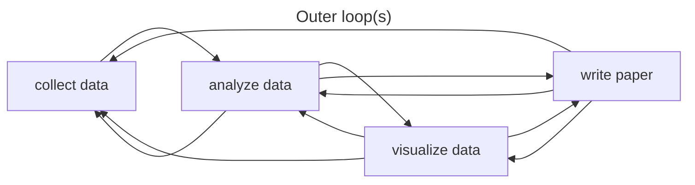
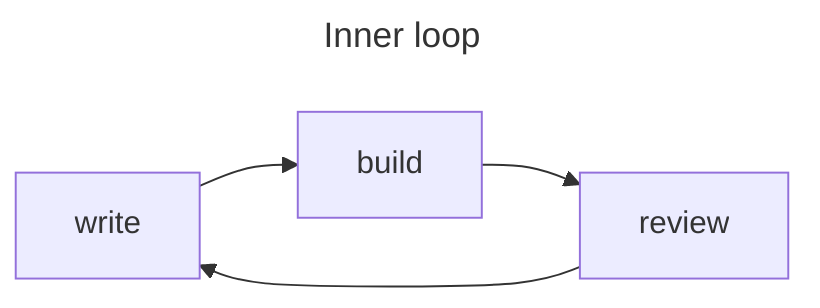

In the 21st century, the
[Agile](https://en.wikipedia.org/wiki/Agile_software_development)
and [DevOps](https://en.wikipedia.org/wiki/DevOps) movements
revolutionized software development,
reducing waste, improving quality,
enhancing innovation,
and ultimately increasing the speed at which software products
were brought into the world.
At the same time, the
[pace of scientific innovation appears to have slowed](https://doi.org/10.1257/aer.20180338) [1],
with many findings failing to replicate
(validated in an end-to-end sense by reacquiring and reanalyzing raw data)
or even reproduce
(obtaining the same results by rerunning the same computational processes
on the same input data).
To help address these issues there are some ideas we could borrow from the
software world.

Here I will focus on one set of practices in particular:
those of _Continuous Integration_ and _Continuous Delivery_
([CI/CD](https://en.wikipedia.org/wiki/CI/CD)).
There has been some discussion about adapting these
under the name
[_Continuous Analysis_](https://arxiv.org/abs/2411.02283) [2],
though since the concept extends beyond analysis and into
generating other artifacts like figures and publications,
here I will use the term
_Continuous Reproducibility_ (CR).

CI means that valuable changes to code are incorporated into a single
source of truth, or "main branch," as quickly as possible,
resulting in a continuous flow of small changes rather than
less frequent, larger batches of changes.
CD means that these updates are accessible to the users as soon as
possible, e.g., daily instead of quarterly or annual
"big bang" releases.

CI/CD best practices ensure that software remains working and available
while evolving,
allowing the developers to feel safe and confident about their modifications.
Similarly, CR would ensure the research
project remains reproducible---its
output artifacts like datasets, figures, slideshows, and publications,
remain consistent with input data and process
definitions---hypothetically allowing researchers to make changes more
quickly and in smaller batches without fear of breaking anything.

In its less mature era,
software was built using the traditional
[waterfall](https://en.wikipedia.org/wiki/Waterfall_model)
project management methodology.
This approach broke projects down into distinct phases or "stage gates," e.g.,
market research, requirements gathering,
design, implementation, testing, deployment,
which were intended to be done in a linear sequence,
each taking weeks or months to finish.
The problem with this approach is that it only works well for projects
with low uncertainty, i.e.,
those where the true requirements can easily be defined up front
and no new knowledge is uncovered between phases.
These situations are of course
rare in both product development and science.

These days, in the software product world, all of the phases are happening
continuously and in parallel.
The best teams are deploying new changes
[many times per day](https://www.atlassian.com/devops/frameworks/devops-metrics),
because generally, the more iterations, the more successful the product.

But it's only possible to do many iterations if cycle times can be shortened.
In the old waterfall framework,
full cycle times were on the order of months or even years.
Large batches of work were transferred between
different teams in the form of documentation.
Further,
the processes to test and release software were manual,
which meant they could be tedious, expensive, and/or error prone.
Thus there was an incentive to do them less often.

One strategy that helped reduce iteration cycle time was
to reduce communication overhead by combining development
and operations teams (hence "DevOps").
This allowed individuals
to simply talk to each other instead of handing off formal documentation.
Another crucial tactic
was the automation of test and release processes with CI/CD pipelines.
Combined, these made it practical to incorporate fewer changes in
each iteration, which helped to avoid mistakes.

I've heard DevOps described as "turning collaborators into contributors."
To achieve this, it's important to minimize the amount of effort required
to get set up to start working on a project.
Since automated CI/CD pipelines typically run on fresh or mostly
stateless virtual machines,
setting up dependencies needs to be automated, e.g.,
with the help of containers and/or virtual environments.
These pipelines then serve as continuously tested documentation,
which can be much more reliable than a list of steps written in a README.

So how does this relate to research projects, and are there potential
efficiency gains to be had if these kinds of practices were to be adopted?

In research projects
we certainly might find ourselves thinking in a waterfall mindset,
with a natural inclination to work in distinct, siloed phases,
e.g., planning, data collection, data analysis, figure generation,
writing, peer review.
But is this really best modeled as
a waterfall process where nothing is learned between
phases?
Do we never, for example, need to
return to data analysis after starting the writing
or peer review process?

Instead, we could think of a research project as one continuous
iterative process.
Writing can be done the entire time in small chunks.
For example,
we can start writing the introduction to our first paper and thesis
from day one, as we do our literature review.
The methods section of a paper can be written as part of planning
an experiment, and updated with important details while carrying it out.
Data analysis and visualization code can be written and tested
before data is collected,
then run while it's being collected as a quality check.
Instead of thinking of the project as a set of decoupled
sub-projects, each a big step done one after the other,
we could think of the whole thing as one unit
that evolves in small steps.

Similar to how software teams work,
where an automated CD pipeline will build all artifacts, such as
compiled binaries or minified web application code,
and make them available to the users,
we can build and deliver all of our research project artifacts each iteration
with an automated pipeline,
keeping them continuously reproducible.
Note that in this case "deliver" could mean to our internal team if we
haven't yet submitted to a journal.

In any case,
the correlation between more iterations and better outcomes
appears to be mostly universal,
so at the very least,
we should look for behaviors that are hurting research
project iteration cycle time.
Here are a few I can think of:

| Problem | Slower, more error-prone solution ❌ | Better solution ✅ |
|---------|--------------|-----------------|
| Ensuring everyone on the team has access to the latest version of a file as soon as it is updated, and making them aware of the difference from the last version. | Send an email with the file and change summary attached to everyone every time a file changes. | Use a single shared version-controlled repository for all files and treat this as the one source of truth. |
| Updating all necessary figures and publications after changing data processing algorithms. | Run downstream processes manually as needed, determining the sequence on a case-by-case basis. | Use a pipeline system that tracks inputs and outputs and uses caching to skip unnecessary expensive steps, and can run them all with a single command. |
| Ensuring the figures in a manuscript draft are up-to-date after changing a plotting script. | Manually copy/import the figure files from an analytics app into a writing app. | Edit the plotting scripts and manuscript files in the same app (e.g., VS Code) and keep them in the same repository. Update both with a single command. |
| Showing the latest status of the project to all collaborators. | Manually create a new slideshow for each update. | Update a single working copy of the figures, manuscripts, and slides as the project progresses so anyone can view asynchronously. |
| Ensuring all collaborators can contribute to all aspects of the project. | Make certain tasks only possible by certain individuals on the team, and email each other feedback for updating these. | Use a tool that automatically manages computational environments so it's easy for anyone to get set up and run the pipeline. Or better, run the pipeline automatically with a CI/CD service like GitHub Actions. |

What do you think?
Is it worth the effort to make a project continuously reproducible
and update it many times per day?
I think it is, though I'm biased,
since I've been working on tools to make CR easier to do
([Calkit](https://calkit.org);
cf. [this example CI/CD workflow](https://github.com/calkit/example-basic/blob/main/.github/workflows/run.yml)).

One argument against setting up an automated CR framework for your
project is that you do very few "outer loop" iterations.
That is, you are able to effectively work in phases so, e.g.,
siloing the writing away from the data visualization is not slowing you down.
I would argue, however, that analyzing and visualizing data
concurrently while it's being collected is a great way to catch
errors.
If the paper is set up and ready to write during data collection,
important details can make their way in directly,
removing a potential source of error from transcribing lab notebooks.

Using Calkit or a similar workflow like that of
[showyourwork](https://show-your.work),
outer and inner loop iterations can be worked on in the same tool
e.g., VS Code,
reducing context switching costs.

On the other hand,
maybe the important cycle time(s) are not for iterations within a given study,
but at a higher level---iterations between studies themselves.
However, one could argue that delivering a fully reproducible
project along with a paper provides a working
template for the next study, effectively reducing that "outer outer loop"
cycle time.

If CR practices mean that it's easy to get set up
and run, and again, the thing actually works,
perhaps the next study can be done more quickly.
At the very least,
the new project owner will not need to reinvent the wheel in terms of
project structure and tooling.
Even if it's just one day per study saved,
imagine how that compounds over time.
I've heard quite a few stories of grad students being handed code
from their departed predecessors with no instructions on how to run it,
no version history, no test suite, etc.,
and apparently that's common enough to make a PhD Comic about it:

If you're convinced of the value of
Continuous Reproducibility---or just curious about it---and
want help implementing CI/CD/CR practices in your lab,
shoot me an [email](mailto:petebachant@gmail.com), and I'd be happy
to help you out.

## References and recommended resources

1. Nicholas Bloom, Charles I Jones, John Van Reenen, and Michael Web (2020).
   Are Ideas Getting Harder to Find?
   _American Economic Review_.
   [10.1257/aer.20180338](https://doi.org/10.1257/aer.20180338)
2. Brett K Beaulieu-Jones and Casey S Greene (2017).
   Reproducibility of computational workflows is automated using continuous
   analysis. _Nat Biotechnol._
   [10.1038/nbt.3780](https://pmc.ncbi.nlm.nih.gov/articles/PMC6103790/)
3. Toward a Culture of Computational Reproducibility.
   [https://youtube.com/watch?v=XjW3t-qXAiE](https://youtube.com/watch?v=XjW3t-qXAiE)
4. There is a better way to automate and manage your (fluid) simulations.
   [https://www.youtube.com/watch?v=NGQlSScH97s](https://www.youtube.com/watch?v=NGQlSScH97s)
