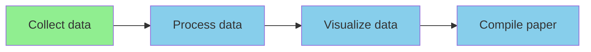
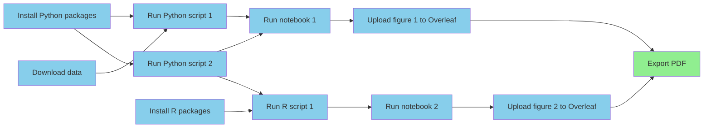

One of the initial visions for computational reproducibility dates back to
the early 90s, where
[Claerbout and Karrenbach](https://doi.org/10.1190/1.1822162)
hoped researchers would be able to
reproduce their results "a year or more later with a single button."
We never quite got there, but we could, and should.

These days, the
[open science movement](https://en.wikipedia.org/wiki/Open_science)
has made code and data sharing more
common,
which is a great achievement,
but often what is shared---sometimes called a
["repro pack"](https://lorenabarba.com/blog/how-repro-packs-can-save-your-future-self/)---is
not single button reproducible.
In fact, in most cases what's shared is
[not reproducible at all](https://doi.org/10.1093/bib/bbad375),
hence why it's called a reproducibility crisis.

Note that I'm not talking about replicability here,
which refers to collecting new raw data
to validate the original study's conclusions.
Reproducibility is a somewhat lower bar to clear:
rerunning the analysis
on the original data and
verifying that it's possible to regenerate the evidence (figures, tables, etc.)
that back up the
original conclusions,
which is more of a test of a study's claimed computational methods.
See
The National Academy's
["Reproducibility and Replicability in Science"](https://nap.nationalacademies.org/read/25303/chapter/1)
and
[The Turing Way](https://book.the-turing-way.org/reproducible-research/overview/overview-definitions/)
for more information.

Download a random repro pack from
[Figshare](https://figshare.com/browse) or
[Zenodo](https://zenodo.org/search?q=&f=resource_type%3Asoftware&l=list&p=1&s=10&sort=newest)
and if you're lucky you'll find a README with
a list of manual steps explaining how to
run the project's analyses.
Often you'll see a collection of numbered scripts and/or notebooks
with no instructions at all.
Sometimes you'll need to manually modify the code to run on your
system,
either because you've been instructed to download some data and put it
somewhere of your choosing, or the original author used absolute paths
that need to be adapted for a new copy of the project.
In other words,
these are not even close to being single button reproducible.

To be clear,
this level of transparency and willingness to share messy code
is laudable,
and failure to reproduce does not necessarily indicate
incorrect conclusions,
but the lack of automation in research workflows presents a huge opportunity
to benefit both the community and the individuals
who are currently publishing
irreproducible work.
Here I'll explain the what, why, and how to get there.

## What is single button reproducibility?

If you can go from raw data to research article with a single
command (or button, but the command line is probably more realistic for now),
your project is single button reproducible.
This one command should include dependency management,
e.g., installing Python or R packages.
However, we can make exceptions for system-level
foundational dependencies like Python distributions,
R, Julia, Docker, etc., even MATLAB.
The distinction here is that these are generally useful across many projects
and do not vary like package versions might.
So, a programming language like Python is a foundational dependency but a
library like Pandas is not.

## Benefits to society

It's not hard to imagine why it would be nice for every single study
to ship with a single button repro pack.
If we imagine each one building upon the last like floors of a skyscraper,
spending time and effort
to get the last's code running is like having to rebuild part
of the floor below, which is clearly inefficient.
And yet this is the story for many grad students who inherit code.
In [this example](https://www.nature.com/articles/d41586-022-01901-x),
getting software from a previous student back to a runnable state
took about half a year.
Imagine if that time were spent creating new things rather than
getting back to square one,
and then imagine scaling those gains across all researchers.



Even if the code isn't nicely generalized and modularized,
i.e., it's a collection of highly specific scripts and notebooks
rather than a _software product_ like an application or library,
it's still much more useful to have something that easily works
than something that does not.
With a working project, one can make small changes to evolve it towards
doing something new.
With a non-working project,
it can be challenging to even know where to start,
and many will choose to start from scratch.
Furthermore,
it's a lot easier to productize an algorithm when you have a working
reference implementation, even if it's going to be rewritten.
In fact,
I'd much rather start with a working collection of
one-off scripts than a half-baked general purpose tool.





## Benefits to the individual

Shipping single button reproducible projects will surely benefit
the next person looking to build on the work,
but what about the original author themselves?
If we want them to play along they're going to need to get something
out of it, and for most this is going to mean things that tenure
committees and funding organizations care about like more publications
and citations.
There's [evidence](https://arxiv.org/pdf/2508.20747)
showing that working openly attracts more citations,
and here I'll argue that automation will achieve faster time-to-publication.

In software engineering
[it's well known](https://dl.acm.org/doi/10.5555/3235404)
that build, test, and deployment
pipelines are worth automating because automation reduces waste and pain points,
ultimately allowing for faster and more frequent iterations.
With more iterations comes a higher quality product.
Fully automated workflows are much less common in science,
but the value comes from the same principles.

Imagine a computational workflow like the one below.
It involves installing dependencies, downloading data,
running scripts in different languages,
running notebooks, saving and uploading figures to
a writing tool like Overleaf,
and then finally exporting a PDF to share with the outside world.
When not automated, each line connecting the boxes represents
"computational logistics," which takes time.
Jumping between different apps and platforms for different tasks creates
["digital tool fatigue."](https://www.forbes.com/sites/bryanrobinson/2025/10/04/digital-tool-fatigue-eroding-mental-health-and-career-productivity/)
If any of these steps ever needs to be done more than once
(which is almost guaranteed),
that is time that could be shaved off the time-to-publication.

Beyond time, each of these low-value-add tasks adds cognitive overhead.
Imagine we need to change something about Python script 2.
Keeping track of what other steps need to be done in response is going
to cost brainpower that would be better spent on so-called
["Deep Work"](https://calnewport.com/deep-work-rules-for-focused-success-in-a-distracted-world/).
Scientists should be thinking up innovative ideas,
not trying to remember if they need to regenerate and reupload a figure.
And again, when this process is tedious,
there's an inclination to do fewer iterations,
which diminishes the quality of the final product.

### The problem with post-hoc repro packs

If you take a look at some repro packs you'll get the feeling that they
were curated after the fact, not used during the work.
Some journals require repro packs to be submitted
and checked as part of the review process,
but most of the time authors are putting these together for the sake
of doing open science,
which is great.
However, doing all that work at the end is another source of waste,
never mind the fact it usually doesn't result in a reproducible project.
All the instructions that end up in the README---install this,
run that, upload here---those are the
low-value-add tasks
that were taking up space in the researcher's mind the whole time.



Imagine instead that the project was automated from the start
to be ["continuously reproducible"](/continuous-reproducibility),
which is sometimes called practicing
[continuous analysis](https://arxiv.org/abs/2411.02283),
[continuous science](https://curvenote.com/blog/open-source-software-powers-open-access),
or
[continuous validation](https://doi.org/10.1093/bib/bbad375).
The point is that we should not divide our project into long stages
and do them in sequence like collect, analyze, visualize, write,
create repro pack.
Instead we should be doing all of those as part of an ongoing process
and releasing artifacts like slideshows, conference papers,
then journal articles when ready.
In addition to faster iteration cycle time,
there would be no more "review anxiety," worrying about if you'll be asked to
change something, either by the PI, a team member, or a referee.
Just change the script or notebook and rerun the project.

## But what about the cost?

Let's say you're with me so far and you believe that there are enough
iterations done and enough waste to eliminate
to justify fully automating research project workflows.
With today's tools and best practices, what does it take
to make a project single button reproducible?
The typical "stack" following current best practices would look something like:

1. Git/GitHub for version controlling code, LaTeX input files, etc.
2. Data backed up in cloud storage, Google Drive, Dropbox, etc., then
   archived on Figshare, Zenodo, or OSF.
3. Dependencies managed with virtual environments and/or containers.
4. Scripting and/or a workflow engine like Make, Snakemake, NextFlow to tie
   everything together, move data around when necessary.

When we ask scientists to work this way we are essentially asking them
to become part-time software engineers: surveying and picking tools,
designing workflows and project layouts, and writing sophisticated
code to tie everything together.
Some will like that and find the tools and processes exciting.
Others will not.
They will want to focus on the science and not want to get bogged down
in what feels like a lot of work (even torture?)
just to do some computation as part of
their research.

In other words, there is a very high cost to doing things this way in
terms of both skill and effort,
and researchers are (fairly, in my opinion) perceiving that the cost is
not worth the benefit,
as it might delay the time-to-paper.
And so there's the challenge.
In the absence of other incentives
(like punishment for irreproducible publications)
we can't expect researchers to publish single button reproducible projects
without driving down the cost of automation.



## Driving down the cost

In order to get to a favorable cost/benefit ratio there are a few
strategic angles:

1. Subsidize the cost:
    1. Of training
    2. Of the software engineering and development
2. Build tools and infrastructure to bring the cost down

Option 1.1 is effectively the strategy of groups like
[The Carpentries](https://carpentries.org/)
and it's one I like.
Computational competency may not fit into most curricula,
but I believe it can improve the productivity of basically any knowledge
worker, so is worth pursuing.

Option 1.2 is a bit newer,
with research software engineer (RSE) becoming a more common job title
in academia (my current one, as a matter of fact).
Essentially the strategy is to pay for the expertise so scientists
don't need to do so much on their own.
I like this one as well,
given that's currently how I make a living,
and it's especially good when RSEs can help produce scientific
software products that help reduce the computational expertise
necessary for other scientists to do their work.

There's a principle in software engineering where once you've done
something the hard way in a similar way a few times,
it's worth building a higher level abstraction for it so it can be
done even more (scaled) more efficiently.
Looking at the current reproducible research stack and best practices
it's clear we're asking researchers to do things the hard way
over and over again, and therefore missing a higher level abstraction.
Building this abstraction (option 2)
is another strategy for bringing down the cost of
single button reproducibility.

The hypothesis is that
there must be a way to allow researchers to take advantage of the
latest and greatest computational tools without needing to be experts
in software engineering.
We should have tools and infrastructure that reduce the
incidental complexity and eliminate unimportant decisions
and other cognitive overhead
while retaining the ability to use state-of-the art libraries
and applications---and of course naturally integrate them all into a
single button reproducible workflow.
This is the vision for [Calkit](https://calkit.org).

## Calkit: Simplified tooling and infrastructure for single button reproducibility

Calkit is a transparent but opinionated wrapper around the "software expert"
tooling and best practices to vertically integrate them into
a simpler research project management experience.
Instead of a loose collection of scripts,
notebooks, data, and documentation,
the framework unifies them into a single coherent unit---a
"calculation kit" if you will, runnable with a single command.
The folks at PLOS have been using the phrase
["knowledge stack"](https://plos.org/redefining-publishing/)
and that describes it well too.
A Calkit project is the entire knowledge stack from a given study in
one neat reproducible package.

The goal is not to replace complex tools like Git,
but to provide a simpler onramp facilitating its use in a research context.
If and when researchers want to interact at a lower level,
there is nothing preventing them from doing so.
We just want to get their foot in the door.

Key concepts:

1. The project is the most important entity and should contain all related
   files. This is sometimes called the
   ["full compendium of artifacts"](https://nap.nationalacademies.org/read/25303/chapter/7#67)
   and includes things like code, data, notes, config files, CAD files,
   figures, tables,
   and of course the research article itself.
   The project is the single source of truth.
2. Any derived artifact, e.g., a figure, should not be shared outside the
   project unless it was produced by its _pipeline_.

If a project can follow the two rules above without
using Calkit, that's great.
The goal is simply a future where most, if not all, studies ship with a
single button repro pack.
How we get there doesn't matter as much.
Let's now take a look at some of the more specific challenges and
strategies for overcoming them.

### Challenge 1: Version control

Because a project's inputs, process definitions, and outputs will
change over time, and those outputs will be delivered at different
times along the life of the project,
it's important to keep a history of changes.
Version control is also critical for collaboration,
allowing people to work concurrently on the same files, i.e.,
not needing to wait for each other like an assembly line.

Besides being notoriously difficult to learn,
Git is also not ideal for large files or binary files that change
often, which will almost certainly be present in a research project.
There are solutions out there that make up for this shortcoming,
e.g., Large File Storage (LFS), git-annex, and [DVC](https://dvc.org),
but all of these require some level of configuration and in some cases
some infrastructure such as S3 buckets or web servers.
Our goal is to not require scientists to be software engineers,
and so naturally
we also don't want to require them to be cloud computing administrators.

Calkit unifies interaction with both Git (for smaller/text files)
and DVC (for larger/binary files) under a single
command line interface (CLI).
As a "gateway drug" to version control,
the CLI has a simple `save` command,
which decides automatically which files belong in which category,
and can generate a commit message for the user.
The actions being taken and an explanation for why are printed to the
terminal.
Users can learn what a staging area is later.
The most important thing is to get them saving each version
of their project.



Calkit also has a complementary cloud system ([calkit.io](https://calkit.io))
that acts as a default DVC remote,
meaning histories of users' data files will be uploaded there
automatically instead of bloating
their Git repositories.
The Calkit Cloud also acts as a wrapper on top of GitHub to provide a
more research-oriented experience.
Instead of interacting with repos, forks, and commits,
users deal with figures, datasets, and publications.
Unlike GitHub, the
[Calkit Cloud software](https://github.com/calkit/calkit-cloud)
is fully open source and
can be self-hosted.
Unlike other data sharing platforms,
it's meant to be used during the work,
as a means of backup and collaboration,
not just as a way to share files at the end.
It can serve as a showcase for the work too,
like how software developers will show off their code on GitHub.



### Challenge 2: Tooling fragmentation

It's important to use the right tool for the job,
but in order to achieve single button reproducibility all tools
need to somehow be tied together.
Researchers may want to use different tools for different tasks,
but also may need to run different processes in different locations.
For example, a simulation may be run on a high performance
computing (HPC) cluster,
the results post-processed and visualized on a laptop,
then written about on a cloud platform like Overleaf.
In a single button reproducible workflow a change to the simulation
parameters results in updated figures and tables on Overleaf without
manually moving files around and picking which script to run.

Calkit's strategy here is simple: Connect these different
systems from the project itself, keeping that as the single
source of truth.
An Overleaf project can be linked to a subdirectory in the project
and synced bidirectionally (without Git submodules).
Stages in the project's pipeline can be run on a SLURM job scheduler
and their results (or a subset) automatically kept in version control,
uploaded to the cloud and ready to pull onto any of the team members'
laptops.
Integration will be a continued effort as new tools and platforms are
introduced,
but as long as they provide APIs,
the problem is tractable.

### Challenge 3: Dependency management

One of the biggest causes of irreproducibility is mutation of the
user's global system environment without properly keeping track of it.
For example,
they may run `pip install ...` to install a package in their system
Python environment and forget about it,
or loosely document it in the project's README.
All of their scripts and notebooks may run just fine on their machine
but fail on others'.

The solution, e.g., for Python projects, is to use a virtual environment.
However, even these can be problematic with common tools promoting a
create-and-mutate kind of workflow.
That is, a virtual environment is created, activated,
then mutated by installing some packages in it.
It's quite easy to add or update packages without documenting them
e.g., in a `requirements.txt`.
It requires discipline (cognitive overhead) from the user to ensure
they properly document the virtual environment.
It even requires discipline to ensure it's activated before running something!

More modern environment managers like uv and Pixi automate
some of this, making it easy to run a command in a virtual environment
and automatically exporting a so-called "lock file" to describe its
exact state, not what the user thought it was.
However,
since these tools are designed for software projects,
they typically assume you'll be working in a single programming language.
For research projects, this assumption is often invalid.
For example,
a user may want to do some statistical calculations in R,
some machine learning in Python,
then compile a paper with LaTeX.

Calkit's solution is to make environments a first class entity in
the project,
allowing users to define as many as they need,
choosing from many different types, e.g.,
Conda, Docker, uv, Pixi, Renv, Julia, or even MATLAB.
When a project is run, relevant environments are checked against their
definitions and lock files are exported,
even if the environment manager in question, e.g., Python's `venv`,
doesn't do that on its own.
This way,
users no longer need to create-and-mutate.
They simply define-and-run.
Similar to with version control systems,
the workings of the environment managers aren't necessarily hidden,
but they don't necessarily need to be known to work reproducibly.

### Challenge 4: Bridging the interactive--batch divide

When writing music,
you can sit at the instrument and keep playing until something sounds right,
or you can spend a long time writing out sheet music imagining what
it will sound like.
The former---an interactive workflow---is more intuitive,
with faster feedback and shorter iteration cycle time.
Interactive workflows are great ways to discover ideas,
but once a valuable creation has been discovered,
it needs to be written down or recorded so it can be reproduced.
The same is true for a figure or data transformation.

And so here's the challenge.
How do you allow researchers to experiment with different ideas
for data processing or visualization in an interactive way
but also get them to "record" what they did so it can be edited
and replayed later?
We need to get them to follow rule 2:
do not share a derived artifact outside the project unless it was
created with the pipeline.
It therefore needs to be easier to automate the creation of a figure than it is
to simply copy and paste it into some slides and email them out.

Calkit's strategy is to make it quick and simple to add interactive tools like
Jupyter notebooks to the pipeline.
A user can run the notebook interactively to explore
how it might work best,
add it to the pipeline, and run the project to see if it properly
produces the thing they'd like to share.
Each stage in the pipeline needs to define the environment in which
it runs,
so there's no need for the user to ensure it's up-to-date,
and outputs can be declared for saving in the project and uploading
to the cloud for sharing.
The cached outputs are invalidated (with DVC)
in response to changes in their
declared inputs or environments,
meaning users can keep running the pipeline and expensive unchanged
steps will be skipped, eliminating the need for them to keep
track in their head.

## Where to next?

Automation presents a huge potential for increasing the pace of
scientific discovery,
but the cost of single button reproducibility is
still too high for most researchers.
Many simply don't have the time or motivation to become
de facto software engineers.

Calkit is a start---perhaps best called an "MVP" or prototype at the
moment---at a simpler back end and the cloud system
is a start at a more purpose-built front end and collaboration hub,
but the user experience is still certainly geared more towards
software engineer types and the problem is certainly not yet solved.
To keep bringing down the complexity more graphical interactions must
be supported.
This will likely take the form of a VS Code extension,
with the goal of making that the single place from which most,
if not all research computation can be done or at least initiated.
Users will need a guided way to create environments and assemble a pipeline.
We'll also need integrations with more user friendly services like
Google Docs, Slides, Sheets, and Colab.

If you're a researcher excited by the prospect of simpler
fully automated workflows,
[give Calkit a try](https://github.com/calkit/calkit?tab=readme-ov-file#installation)
and consider joining the project as a design partner.
You'll get free "reproducibility consulting" and
any ideas we discover will be fed back into the development so
others can benefit.
Similarly, if you're a software developer and this vision resonates with you,
consider joining the project.
There's lots to build, training materials to create,
and it's still early so you have an opportunity
to make a significant impact on the project's direction and outcomes.
