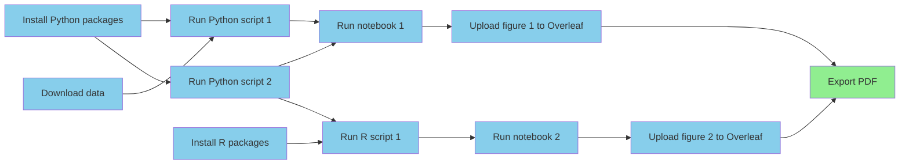

One of the initial visions for computational reproducibility dates back to
the early 90s, where
[Claerbout and Karrenbach](https://doi.org/10.1190/1.1822162)
shared that they hoped researchers would be able to
reproduce their results "a year or more later with a single button."

These days, the
[open science movement](https://en.wikipedia.org/wiki/Open_science)
has made code and data sharing more
prevalent,
which is a great achievement,
but often what is shared—sometimes called a
["repro pack"](https://lorenabarba.com/blog/how-repro-packs-can-save-your-future-self/)—is
very rarely single button reproducible.
In fact, in most cases repro packs are
[not reproducible at all](https://doi.org/10.1093/bib/bbad375),
hence why it's called a reproducibility crisis.

Not the I'm not talking about replicability here,
which refers to collecting new raw data
to validate the original study's conclusions.
Reproducibility is a lower bar to clear:
rerunning the analysis
on the original data and
verifying that it's possible to regenerate the evidence (figures, tables, etc.)
that back up the
original conclusions.
See
[The Turing Way](https://book.the-turing-way.org/reproducible-research/overview/overview-definitions/)
for more information.

Download a random repro pack from
[Figshare](https://figshare.com/browse) or
[Zenodo](https://zenodo.org/search?q=&f=resource_type%3Asoftware&l=list&p=1&s=10&sort=newest)
and if you're lucky you'll find a README with
a list of manual steps explaining how to
run the project's analyses.
Often you'll see a collection of numbered scripts and/or notebooks
with no instructions at all.
Sometimes you'll need to manually modify the code to run on your
system,
either because you've been instructed to download some data and put it
somewhere of your choosing, or the original author used absolute paths
that need to be adapted for a new instance of the project.
In other words,
these are not even close to being single button reproducible.

To be clear,
this level of transparency and willingness to share messy code
is laudable,
and failure to reproduce does not necessarily indicate
incorrect conclusions,
but the lack of automation in research workflows presents a huge opportunity
to benefit both the community and the individuals
who are currently publishing
irreproducible work.
Here I'll explain the what, why, and how to get there.

## What is single button reproducibility?

Basically, if you can go from raw data to research article with a single
command (or button, but the command line is probably more realistic for now),
your project is single button reproducible.
This one command should include dependency management,
e.g., installing Python or R packages.
However, we can make exceptions for system-level
foundational dependencies like Python distributions,
R, Julia, Docker, etc., even MATLAB.
The distinction here is that these are generally useful across many projects
and do not vary like package versions might.
So, a programming language like Python is a foundational dependency but a
library like Pandas is not.


## Benefits to society

It's not hard to imagine why it would be nice for every single study
to ship with a single button repro pack.
If we imagine each one building upon the last like floors of a skyscraper,
spending time and effort
to get the last's code running is like having to rebuild part
of the floor below, which is clearly inefficient.
And yet this is the story for many grad students who inherit code.
In [this example](https://www.nature.com/articles/d41586-022-01901-x),
getting software from a previous student back to a runnable state
took about half a year.
Imagine if that time were spent creating new things rather than
getting back to square one,
and then imagine scaling those gains across all researchers.



Even if the code isn't nicely generalized and modularized,
i.e., it's a collection of highly specific scripts and notebooks
rather than a _software product_ like an application or library,
it's still much more useful to have something that easily works
than something that does not.
With a working project, one can make small changes to evolve it towards
doing something new.
With a non-working project,
it can be challenging to even know where to start,
and many will choose to start from scratch.
Furthermore,
it's a lot easier to productize an algorithm when you have a working
reference implementation, even if it's going to be rewritten.
In fact,
I'd much rather start with a working collection of
one-off scripts than a half-baked general purpose tool.



## Benefits to the individual

Shipping single button reproducible projects will surely benefit
the next person looking to build on the work,
but what about the original author themselves?
If we want them to play along they're going to need to get something
out of it, and for most this is going to mean things that tenure
committees and funding organizations care about like more publications
and citations.
There's [evidence](https://arxiv.org/pdf/2508.20747)
showing that working openly attracts more citations,
and here I'll argue that automation will achieve faster time-to-publication.

In software engineering
[it's well known](https://dl.acm.org/doi/10.5555/3235404)
that build, test, and deployment
pipelines are worth automating because automation reduces waste and pain points,
ultimately allowing for faster and more frequent iterations.
With more iterations comes a higher quality product.
Fully automated workflows are much less common in science,
but the value comes from the same principles.

Imagine a computational workflow like the one below.
It involves installing dependencies, downloading data,
running scripts in different languages,
running notebooks, saving and uploading figures to
a writing tool like Overleaf,
and then finally exporting a PDF to share with the outside world.
When not automated, each line connecting the boxes represents
"computational logistics," which takes time.
If any of these steps ever needs to be done more than once
(which is almost guaranteed),
that is time that could be shaved off the time-to-publication.



Beyond time, each of these low-value-add tasks adds cognitive overhead.
Imagine we need to change something about Python script 2.
Keeping track of what other steps need to be done in response is going
to cost brainpower that would be better spent on so-called
["Deep Work"](https://calnewport.com/deep-work-rules-for-focused-success-in-a-distracted-world/).
Scientists should be thinking up innovative ideas,
not trying to remember if they need to regenerate and reupload a figure.
And again, when this process is tedious,
there's an inclination to do fewer iterations,
which diminishes the quality of the final product.

### No more retrospective repro packs

Now that more and more journals are requiring repro packs to be submitted
and checked as part of the review process
(none that I've submitted or reviewed for sadly),


Imagine the project being continuously reproducible

No more "review anxiety" worrying about if you'll be asked to
change something, either by the PI, a team member, or a referee.
Just change the script or notebook and rerun the project.

## But what about the cost?

Let's say you're with me so far and you believe that there are enough
iterations done in a research project to justify automating the workflow.
With today's tools and best practices, what will it take and what will it
look like to make a project single button reproducible?
An example "stack" would look something like:

1. Git/GitHub for version controlling code, LaTeX input files, etc.
2. Data backed up in cloud storage, Google Drive, Dropbox, etc., then
   archived on Figshare, Zenodo, or OSF.
3. Dependencies managed with virtual environments and/or containers.
4. Scripting and/or a workflow engine like Make, Snakemake, NextFlow to tie
   everything together, move data around when necessary.

It's not surprising that single button reproducibility is rare given that
the practices above amount to expecting scientists to become part time
software engineers, pick their tools, design bespoke frameworks for
each project, etc.

Essentially, we're asking scientists to choose a version control system,
data archival system, dependency/environment manager(s),
workflow manager,
and tie them all together on their own.

What's missing is a research project management tool—one for projects
that answer questions, not necessarily produce software products.

In other words, there is a very high cost to doing thing this way in
terms of both skill and effort,
and researchers are (probably rationally) perceiving that the cost is
not worth the benefit,
as it might delay the time-to-paper.


And so there's the challenge.
In the absence of other incentives
(like punishment for irreproducible publications)
we can't expect researchers to publish single button reproducible projects
without driving down the cost of automation.

## So how do we get there?

By now maybe you agree that single button reproducibility is a good
thing.
However, given the cost, perhaps it's in the "nice to have" category.
The papers need to get out the door,
and you don't think the cost/benefit analysis justifies it right now.

1. Subsidize the cost:
    1. Of training
    2. Of the software engineering work
2. Build tools and infrastructure to bring the cost down

Option 1.1 is effectively the strategy of
[The Carpentries](https://carpentries.org/)
and it's one I like.
Computational literacy may not fit into most college curricula,
but I believe it can improve the productivity of basically any knowledge
worker.

Option 1.2 is a bit newer,
with research software engineering (RSE) becoming a more common job title
in academia (my current one).
Essentially the strategy is to pay for the expertise so scientists
don't need to do so much on their own.
I like this one as well,
given that's currently how I make a living,
and it's especially good when RSEs can help produce scientific
software products that help reduce the computational expertise
necessary for other scientists to do their work.

I also believe that there is unnecessary complexity in some typical
computational practices in research,
which is worth building tooling infrastructure around to allow researchers
to work at a higher level of abstraction.
Is it really reasonable to expect scientists to become part time SWEs so
their R and Python scripts can be reproducible?
Or do we expect them all to hire experts in somewhat high demand for
relatively simple computational workflows?
This is where option 2 comes in,
and I think we need to continue down that path.

## Simplified tooling and infrastructure

```python
# Project 1
install_dependencies()
create_figures()
do_git()
build_caching()
cache_data()
run_simulation()
compile_paper()

# Project 2
install_dependencies()
create_figures()
do_git()
build_caching()
cache_data()
run_simulation()
compile_paper()

# Project 3
install_dependencies()
create_figures()
do_git()
build_caching()
cache_data()
run_simulation()
compile_paper()
```

```python
def do_research():
    """An abstraction around reproducible research."""
    install_dependencies()
    create_figures()
    do_git()
    build_caching()
    cache_data()
    run_simulation()
    compile_paper()

# Project 1
do_research()

# Project 2
do_research()

# Project 3
do_research()
```

Of course I will need to talk about Calkit now.

Instead of a loose collection of scripts,
notebooks, data, and documentation,
a framework unifies them into a single coherent unit.
There are analogous frameworks for building software.
For example, Python packages use

Concepts:

1. The project is the most important entity and should contain all related
   files.
2. Any derived artifact, e.g., a figure, should not be shared outside the
   project unless it was produced by its pipeline.

Follow these two rules, and you'll be more efficient...

### Challenge 1: Version control

### Challenge 2: Tooling fragmentation

### Challenge 3: Dependency management

### Challenge 4: Bridging the interactive--batch chasm

When someone creates, for example, a figure that they like.
They will naturally assume they're done, i.e.,
they won't have to do it again, or they won't
need to iterate on it.
So they won't think they need to automate its creation.

What we need is a way to essentially create a replayable and editable
history of what they did.

## Where Calkit is heading


## Reproducibility: What is it?

First off, what is reproducibility?
The Turing Way handbook has a good section on this.
Basically, it means that with the same data and tools,
anyone can get the same results.

This is not to be confused with replicability,
which involves collecting new data.

If we create a simple model of the research process as a
directed acyclic graph (DAG),
it might look like this:


In this model, reproducibility involves the latter three stages,
which replicability includes them all.

## How bad is the 'crisis'?

## The gold standard

In the original

Single button

Where do we draw the line?
Some have said 15 minutes of labor max.
Personally, I think we should shoot for the moon here.

"Foundational" dependencies are an exception.
Things like package managers, Docker, etc.
Individual package installs must be automated though.

From this standard, a study that takes an hour of human labor to reproduce
would technically not be considered reproducible.
It kind of is, but in my opinion we should be shooting for the gold standard.
We'll discuss a bit more about why that's important later on.

## A rule of thumb

If you want to share something, e.g., a figure, dataset, or ML model,
produce it as part of a version-controlled
single button pipeline so there's never any question
how it came to be.

## Relation to open science

To be reproducible, it must be open.
However, it's possible to be open but not reproducible.
In fact, that's very common.

## Are our methods unsound?

>I don't see any methods at all.

Accurate description of methods is an integral part of any scientific study.
However, the computational tools available to researchers
these days are so complex that traditional ways of describing methods—prose
and mathematical formulas—are no longer sufficient.

## The state of the art in open reproducible science

Lists in a README

A conflation of repro/reuse

If one did truly want to make their work single-button reproducible,
what would it take?

## Why reproducibility is rare

Cost/benefit

Cost can be getting scooped

Costs of manual workflows are not obvious

Hidden or forgotten global state

Interactivity causes this, but interactivity is key

Fragmentation

For software development, it is now taken for granted that automating
testing and deployment is always worth the cost,
but is that true for research work?

## The costs and gains to be had

Scientists provide value by thinking up innovative ideas
and turning them into knowledge.
They do this with the scientific method.
Any unnecessary work done along the way is waste.

Let's try to estimate that waste.

What are some examples of wasteful activities:

- Determining which figures need to be regenerated after a change in data
  processing logic.
- Manually uploading new figures to Overleaf or re-importing into Microsoft
  Word.
- Manually copying data to and from an HPC cluster.

TODO: Make some back of the envelope estimates and show that if
reproducibility were free,
science would advance X% faster.

## The role of interactivity

Interactivity is necessary for discovering the computations that work.

However, interactive workflows need to be converted into batch workflows
once they are deemed valuable.
That is the costly part that often doesn't make immediate sense to do.

We lose the breadcrumbs.

Global system changes that now get us working.
We could document them, but that's also costly.

Let's to back to the rule of thumb with an example.
Say you're playing around and stumble upon a way of visualizing the data
the elucidates an answer to an important question.
Before sending it off to your team on Slack,
put the script or notebook or whatever into a pipeline, run it,
and share the version created there.

So how to we bridge the divide?

## Why we should improve

Eliminating mistakes: Let's forget about that because in peer review it's
hardly ever checked.
However, it's a given.

We are going to focus on benefits to the individual,
not society.

Efficiency gains

Iteration cycle time

Can we do a simulation to show where the tipping point is with simpy?

Reusability

A nice reproducible research project serves as a platform for doing more
science, not as a platform for developing software.

I often see repro packs written in such a way that they attempt to
deliver half-baked tools instead of the research project itself.
This may be out of humility.
Why would anyone want code that simply produces the results in my paper
but nothing more?

The thing is,
in trying to make your code more reusable you broke its ability to achieve
its original purpose!

## The goal: Reduce the cost and increase the benefits


## My current hypothesis for a solution: Full stack science

Silos and handoffs are bad.

Maybe don't need this section

Bring down the cost and improve the benefit

Education is a cost
Can we reduce the amount of training required by building better
computational tooling and infrastructure?

If you look at the landscape, there are so many tools out there to use,
but it's very rare to tie them all together.

This is the direction we've been heading with Calkit,
and we're going to keep driving down the cost of automation.

Is literate programming the answer?
I'm skeptical that it will be intuitive to people to declare a big
computing job to be run on an HPC inside of a document,
but maybe.
