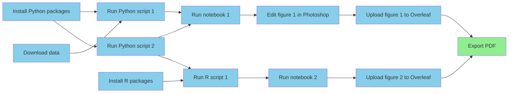

One of the initial visions for computational reproducibility dates back to
the early 90s, where
[Claerbout and Karrenbach](https://doi.org/10.1190/1.1822162)
imagined researchers able to
reproduce their results "a year or more later with a single button."
In other words, they hoped it would be possible to run a single command to
transform any study's raw data into figures, tables, and finally
a complete research article.
We never quite got there, but we could, and we should.


These days, the
[open science movement](https://en.wikipedia.org/wiki/Open_science)
has made code and data sharing more
appreciated and more common,
which is a great achievement,
but often what is shared---sometimes called a
["repro pack"](https://lorenabarba.com/blog/how-repro-packs-can-save-your-future-self/)---is
not single button reproducible.
In fact, in most cases what's shared is
[not reproducible at all](https://doi.org/10.1093/bib/bbad375),
hence why it's called a _reproducibility crisis_.

Download a random repro pack from
[Figshare](https://figshare.com/browse) or
[Zenodo](https://zenodo.org/search?q=&f=resource_type%3Asoftware&l=list&p=1&s=10&sort=newest)
and if you're lucky you'll find a README with
a list of manual steps explaining how to install necessary
packages, download data to certain locations, and
run the project's analyses and visualizations.
Often you'll see a collection of numbered scripts and/or notebooks
with no instructions at all.
Sometimes you'll need to manually modify the code to run on your
system because the original author used absolute paths
or it depends on credentials for some external web service.
In other words,
these are not even close to being single button reproducible.

To be clear,
this level of transparency and willingness to share messy code
is admirable and should be rewarded.
Fragility in evidence generation does not necessarily indicate
incorrect conclusions, laziness, or misconduct.
Nevertheless, that fragility
and the lack of automation in research workflows present a huge opportunity
to benefit both the community and the individuals involved.

## Benefits to the community

It's not hard to imagine why it would be helpful for every study
to ship with a single button repro pack.
If we think of each new one building upon the last like floors of a skyscraper,
spending time and effort
to get a predecessor's code running is like having to rebuild part
of the floor below, which is clearly inefficient.
Yet this is the story for many grad students and postdocs.
In [this example](https://www.nature.com/articles/d41586-022-01901-x),
getting software from a previous student back to a runnable state
took half a year.
Imagine if that time were spent creating new things rather than
reproducing old ones to get back to square one,
and then imagine scaling those gains across all researchers.



Even if the code isn't nicely generalized and modularized,
i.e., it's a collection of highly specific scripts and notebooks
rather than a _software product_ like an application or library,
it's still much more useful to have something that works
than something that does not.
With a working project, one can make small changes to evolve it towards
doing something new.
With a non-working project,
it can be challenging to even know where to start,
and many will choose to start from scratch.
Furthermore,
it's a lot easier to productize an algorithm when you have a working
reference implementation, even if it's going to be rewritten.
Personally,
I'd much rather start with a working collection of
one-off scripts wrapped up into a single command
than a half-baked general purpose tool.





## Benefits to the individual

Shipping single button reproducible projects will surely benefit
those looking to build on the work,
but what about the original authors themselves?
If we want them to play along they're going to need to get something
out of it, and for most this is going to mean things that tenure
committees and funding organizations care about like publications
and citations.
There's [evidence](https://arxiv.org/pdf/2508.20747)
that working openly attracts more citations,
and here I'll argue that automation will achieve faster time-to-publication
with improved quality.

In software engineering
[it's well known](https://dl.acm.org/doi/10.5555/3235404)
that build, test, and deployment
pipelines are worth automating because automation reduces waste and
eliminates pain points,
ultimately allowing for faster and more frequent iterations.
With more iterations---more times at bat---comes a higher
quality product and more positive impact
on customers and the business.
Fully automated workflows are much less common in science,
but the value comes from the same principles.

Imagine a computational workflow like the one below.
It involves installing dependencies, downloading data,
running scripts in different languages,
running notebooks, saving and uploading figures to
a writing tool like Overleaf,
and then finally exporting a PDF to share with the world.
When not automated, each line connecting the boxes represents
"computational logistics," which take time and don't add value
to the final product.
If any of these steps needs to be done more than once
(which is almost guaranteed),
their automation would speed up time-to-publication.



Beyond time wasted,
each of these low-value-add tasks increases cognitive overhead,
and switching between different apps and platforms for different tasks creates
["digital tool fatigue."](https://www.forbes.com/sites/bryanrobinson/2025/10/04/digital-tool-fatigue-eroding-mental-health-and-career-productivity/)
Imagine we need to change something about Python script 2.
Keeping track of what other steps need to be done in response is going
to cost brainpower that would be better spent on so-called
["Deep Work"](https://calnewport.com/deep-work-rules-for-focused-success-in-a-distracted-world/).
Scientists should be thinking up innovative ideas,
not trying to remember if they need to regenerate and reupload a figure
and which script created it.
Again, when this process is tedious because it's manual,
there's an inclination to do fewer iterations,
which diminishes quality.

### The problem with post-hoc repro packs

Sometimes you'll take a look at a repro pack
and get the feeling it
was curated after the fact, not used during the work.
Some journals require repro packs to be submitted
and checked as part of the review process,
but most of the time authors are putting these together for the sake
of doing open science.
Again, this is much better than not sharing,
but doing all that work at the end is another source of waste,
never mind the fact it usually doesn't result in a reproducible project.
All the instructions that end up in the README---install this,
run that, upload here---those are the
low-value-add tasks
that were taking up space in the researcher's brain the whole time.



Imagine instead that the project was automated from the start
to be ["continuously reproducible"](/continuous-reproducibility),
which is sometimes called practicing
[continuous analysis](https://arxiv.org/abs/2411.02283),
[continuous science](https://curvenote.com/blog/open-source-software-powers-open-access),
or
[continuous validation](https://doi.org/10.1093/bib/bbad375).
The researcher would do some work on one aspect of the project,
save it, push the button to get it into a reproducible state,
and then work on the next task.
In addition to faster iteration cycle time,
there would be no more "review anxiety," worrying if you'll be asked to
change something, either by the principal investigator (PI),
a team member, or a referee.

## But what about the cost?

Let's say you're with me so far---you believe that there are enough
iterations done and enough waste to eliminate
to justify automating research project workflows end-to-end.
With today's tools and best practices, what does it take?
The typical "stack" following current best practices would look something like:

1. Git/GitHub for version controlling code, LaTeX input files, etc.
2. Data backed up in cloud storage, Google Drive, Dropbox, etc., then
   archived on Figshare, Zenodo, or OSF.
3. Dependencies managed with virtual environments and/or containers.
4. Scripting and/or a workflow engine like Make, Snakemake, NextFlow to tie
   everything together and move data around when necessary.

When we ask scientists to work this way we are essentially requesting
they become part-time software engineers: surveying and picking tools,
designing workflows and project layouts, and writing sophisticated
code to tie everything together.
Some will like that and find the tools and processes exciting.
Others will not.
They will want to focus on the science and not want to get bogged down
with what feels like a lot of extra work
just to do some computation as part of
their research.

In other words, there is a very high cost to single button reproducibility in
terms of both skill and effort,
and researchers are (fairly, in my opinion) perceiving that the cost is
not worth the benefit,
as it might delay time-to-publication.
And so there's the challenge.
In the absence of other incentives
(like punishment for irreproducible publications)
we can't expect all,
or even most researchers to publish single button reproducible projects
without driving down the cost of automation.



## Driving down the cost

In order to get to a favorable cost/benefit ratio there are a few
strategic angles:

1. Subsidize the cost:
    1. Of training
    2. Of the software engineering and development
2. Build tools and infrastructure to bring the cost down

Option 1.1 is effectively the strategy of groups like
[The Carpentries](https://carpentries.org/)
and [The Turing Way](https://book.the-turing-way.org)
and it's a good one.
Computational competency may not fit into most curricula,
but it can improve the productivity of virtually any knowledge
worker, and is therefore worth pursuing.

Option 1.2 is a bit newer,
with research software engineer (RSE) becoming a more common job title
in academia (my current one, as a matter of fact).
The idea is to formalize and pay for the expertise so scientists
don't need to do so much on their own.
I like this one as well,
and not just because it's currently how I make a living.
Besides teaching and promoting software engineering best practices,
RSEs can help scientists turn their newly discovered
knowledge into software products to maximize value and impact.

But what about more general tooling and infrastructure to bring
down the cost of reproducibility?

There's a principle in software engineering where once you've done
something the hard or verbose way a few times,
it's worth building a higher level abstraction for it so it can be
used in additional contexts (scaled) more easily.
Looking at the current reproducible research stack and best practices
it's clear we're asking researchers to do things the hard way
over and over again, and therefore missing such an abstraction.

The hypothesis is that
there must be a way to allow researchers to take advantage of the
latest and greatest computational tools without needing to be experts
in software engineering.
We should have tools and infrastructure that reduce the
incidental complexity and eliminate unimportant decisions
and other cognitive overhead
while retaining the ability to use state-of-the art libraries
and applications---and of course naturally integrate them all into a
single button reproducible workflow.

## Simplified tooling and infrastructure for single button reproducibility

Many of the components to build a single button reproducible workflow
exist, mostly from the software development world.
We don't need to replace them with some new monolith.
We just need something to tie them all together into a simpler,
vertically-integrated research-focused
experience with a gentler learning curve.

### Key concepts

Single button reproducibility can be achieved by following two rules:

1. The _project_ is the most important entity,
   the single source of truth, and should contain all related
   files. This is sometimes called the
   ["full compendium of artifacts"](https://nap.nationalacademies.org/read/25303/chapter/7#67)
   or the ["full knowledge stack"](https://plos.org/redefining-publishing/)
   and includes things like code, data, notes, config files, CAD files,
   figures, tables,
   and of course the research article.
   For very large artifacts like datasets, uniquely identifiable pointers
   can be included in the project to reference remote storage.
2. Any derived artifact, e.g., a figure, should not be shared outside the
   project unless it was produced by its _pipeline_
   (the thing that runs with the single button).

Our goal is to make it easy for researchers to
follow these rules without becoming de facto
software engineers,
so we might see a future where most, if not all,
studies ship with a
single button repro pack.
Now let's discuss some of the more specific challenges and
strategies for overcoming them.

### Challenge 1: Version control

Because a project's inputs, process definitions, and outputs will
change over time, and those outputs will be delivered at different
point along the life of the project,
it's important to keep a history of changes.
Version control is also critical for collaboration,
allowing people to work concurrently on the same files, i.e.,
not needing to wait for each other like an assembly line.

Seasoned and somewhat elitist software engineers will say "let them use Git!"
However, besides being notoriously complex and difficult to learn,
Git is also not ideal for large files or binary files that change
often, which will almost certainly be present in a research project.
There are solutions out there that make up for this shortcoming,
e.g., Large File Storage (LFS), git-annex, and [DVC](https://dvc.org),
but all of these require some level of configuration and in some cases
additional infrastructure such as S3 buckets or web servers.
Our goal is to not require scientists to be software engineers,
and so naturally
we also don't want to require them to be cloud computing administrators.

What I propose is something akin to training wheels for Git
with support for large files built in.
Git provides a solid and performant back end.
It just needs a transparent but opinionated wrapper on top to provide
an onramp with clear guardrails to get beginners used to
saving the full histories of their projects.
Once users feel comfortable using it in easy mode,
they can start doing more advanced things if desired.

GitHub is the typical place to share Git repositories,
and researchers will typically use GitHub to host their code
(because GitHub is designed software development),
siloing it from the rest of the project materials.
What we need is a GitHub for research---a place to store, collaborate on,
and share research projects (all files, not just code)
throughout their entire lifecycle.
Further, the platform's data model needs to be tailored to the domain.
Instead of interacting with repos, forks, and commits,
we need an app that deals with
figures, datasets, and publications.
[Hugging Face](https://huggingface.co/) has done something similar
for machine learning.

Lastly, it's important that this new platform be
fully open source (GitHub is not, by the way).
Centralization of control is antithetical to the principles of open science
and represents a significant risk.

### Challenge 2: Tooling fragmentation

It's important to use the right tool for the job,
but in order to achieve single button reproducibility all tools
need to somehow be tied together.
Researchers may also need
to run different processes in different locations.
For example, a simulation may be run on a high performance
computing (HPC) cluster,
the results post-processed and visualized on a laptop,
then written about on a cloud platform like Overleaf.
In a single button reproducible workflow a change to the simulation
parameters results in updated figures and tables in the paper without
manually moving files around and picking which scripts to run.

We need a way to connect all of these different tools together
so researchers don't need to hop around and manually transfer data
between them.
We need the project to remain the single source of truth
but be able to sync out to these more specialized tools.
We'll likely need to integrate, not necessarily replace,
things like Google Docs, Sheets, Slides, Microsoft Office,
and Google Colab.
Importantly, in order to be beginner friendly,
we need a graphical user interface (GUI) that enables data collection,
exploration, analysis, and writing all in one place,
with an easy way to build and run the project's pipeline
and keep track of version history.

### Challenge 3: Dependency management

One of the biggest causes of irreproducibility is mutation of
(read: installing things in) the
user's global system environment without proper tracking.
In other words,
they make a bunch of changes to get something working but
can't remember or explain how to do it again.
For example,
they may run `pip install ...` to install a package in their system
Python environment and forget about it,
or loosely document that in the project's README.
All of their scripts and notebooks may run just fine on their machine
but fail on others'.

The status quo solution, e.g., for Python projects,
is to use a virtual environment.
However, even these can be problematic and confusing
with typical tools promoting a
create-and-mutate kind of workflow.
That is, a virtual environment is created, activated,
then mutated by installing some packages in it.
It's quite easy to add or update packages without documenting them
e.g., in a `requirements.txt`.
It requires discipline (cognitive overhead) from the user to ensure
they properly document the virtual environment.
It even requires discipline to ensure it's activated before running something!

```sh
# Create a virtual environment
python -m venv .venv
# Activate it, and remember to activate it every time!
source .venv/bin/activate
# Now mutate the environment
pip install -r requirements.txt
# Now what if I mutate further and forget to document?
pip install something-else
```

More modern environment managers like uv and Pixi automate
some of this, making it easy to run a command in a virtual environment
and automatically exporting a so-called "lock file" to describe its
exact state, not what the user thought it was.
However,
since these tools are designed for software projects,
they typically assume you'll be working in a single programming language.
For research projects, this assumption is often invalid.
For example,
a user may want to do some statistical calculations in R,
some machine learning in Python,
then compile a paper with LaTeX,
all within the scope of a single project.

What we need is a project format and manager that allows different
environment types,
e.g., Python, Docker, R, Julia, or even MATLAB,
to be used for different parts of the workflow,
and provides a similar interface to create, update, and use each.
Users should not be forced to check if environments match
their specification, nor should they be expected to document them manually.
They should be able to simply define and run.

### Challenge 4: Bridging the interactive--batch divide

When writing music,
you can spend a long time writing it all out on paper,
imagining what it will sound like,
then have someone play it at the end,
or you can sit at the instrument and keep playing until it sounds right.
The latter---an interactive workflow---is more intuitive,
with faster feedback and shorter iteration cycle time.
Interactive workflows are great ways to discover ideas,
but once a valuable creation has been discovered,
it needs to be written down or recorded so it can be reproduced
in a batch process.
The same is true for creating a figure or data transformation.

This problem is similar to dependency management.
When working interactively,
it's possible to arrive at an output you like while losing track
of how you got there.
And so here's the challenge:
How do we allow researchers to experiment with different ideas
for data processing or visualization in an interactive way
but also get them to "record" what they did so it can be edited
and replayed later?

Following the second rule of single button reproducibility,
we need to get researchers to produce derived artifacts with a project's
pipeline before sharing.
It therefore needs to be easier to automate the creation of a figure than it is
to simply copy and paste it into some slides and email them out.
What we need is a pipeline that is easy to create, update, and understand.
Users need to be able to run something like
a Jupyter notebook interactively to explore
how it might work best,
add it to the pipeline, and run the project to see if it properly
produces the thing they'd like to share.

The pipeline also needs to be able to run quickly so users don't need to think
about which stages need to be run---that would be a multi-button
workflow.
In other words,
it will need to cache outputs and only rerun stages when the cache becomes
invalidated.

Lastly, the platform they're working in should
also make it easy to share artifacts
there so it's less tempting to export the interactively created version.

## If we build it...

Automation presents a huge potential for increasing the pace of
scientific discovery,
but the cost of single button reproducibility is
still too high for most researchers.
Many simply don't have the time or desire to become
de facto software engineers, and that's okay.
In addition to providing training and support,
we need to meet them in the middle with a less software development-oriented,
more research-oriented and user friendly set of tools and infrastructure.
Nevertheless, we should strive for this higher standard of
reproducibility.

[Calkit](https://calkit.org) is a start down this path,
but I certainly won't claim we've yet solved all of these problems.
If you're a researcher excited by the prospect of simpler
fully automated workflows,
consider joining the project as a design partner.
You'll get free "reproducibility consulting" and
any ideas we discover will be fed back into the development so
others can benefit.
Similarly, if you're a software developer and this vision resonates with you,
consider [getting involved](https://github.com/calkit).
